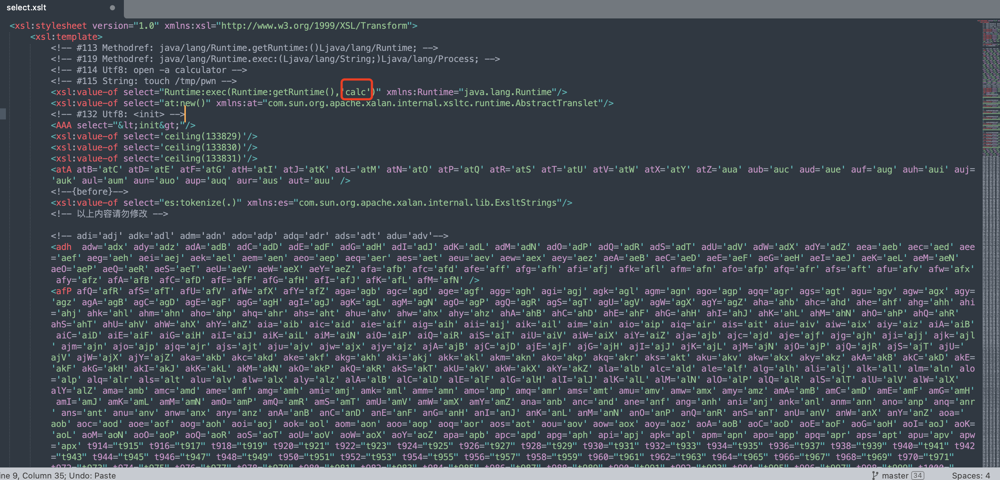
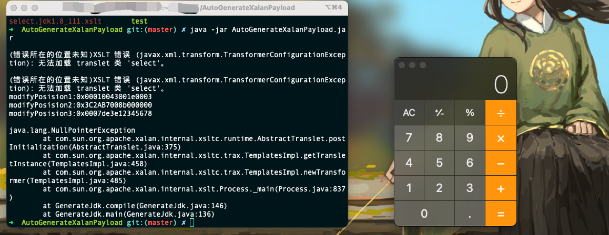

# AutoGenerateXalanPayload

### 简介

这是一款根据cve-2022-34169漏洞延伸出的一个针对jdk xalan溢出漏洞的payload自动化生成工具。由于发现不同版本的Jdk所需要的溢出payload不同，所以这个自动化的生成工具诞生了，只需要用不同版本的JDK运行这个工程就可以生成出不同的xslt利用文件。

### 使用说明

复制select.bak.xslt为select.xslt，修改自己要执行的命令

然后运行java -jar AutoGenerateXalanPayload.jar即可，过程中又一些错误抛出，忽略即可。程序运行完毕后得到的select.xslt即为符合该jdk版本的xalan溢出命令执行的payload

### 改造思路

https://mp.weixin.qq.com/s/xxAtjFvk9RxWiY-pwGf8Ow

### JDK版本对比

由于JDK小版本太多，因此我使用了二分法对比了jdk1.6-jdk1.8的版本。用测试1.7版本举例子，先测jdk1.7最高的小版本,得到一个xslt，设定这个xslt内容为A类型。再测试jdk1.7最低的小版本，得到一个xslt，如果这个xslt和1.7最高的小版本生成的内容完全一样，则表示jdk1.7最低到最高之间全部都通用一个A类型的payload。如果不一样的话，那我再取jdk1.7的中间版本测，就这样一直二分，这是我想到的测的最快的方式了，不用全部都安装测试又能覆盖到全部。举一个下面测试好的实例，Jdk-8u301为A类型payload，Jdk-8u202为A类型payload，那Jdk-8u221是这两位的中间版本，他不可能是B类型的payload吧？

下面是我所测试得到的成果，得出jdk1.6到1.8之间有六种payload。

| jdk版本   | xsls类型 |
| --------- | -------- |
| Jdk-8u301 | A        |
| Jdk-8u202 | A        |
| Jdk-8u162 | A        |
| Jdk8u152  | A        |
| Jdk8u151  | B        |
| Jdk8u144  | B        |
| Jdk8u131  | B        |
| Jdk8u121  | C        |
| Jdk8u111  | C        |
| Jdk8u102  | D        |
| Jdk8u101  | D        |
| Jdk8u91   | D        |
| Jdk8u60   | D        |
| Jdk8u20   | D        |
| Jdk7u40   | D        |
| Jdk7u21   | D        |
| Jdk7u10   | D        |
| Jdk7u05   | D        |
| Jdk7u04   | D        |
| Jdk7u03   | E        |
| Idk7u02   | E        |
| Jdk7u0    | E        |
| Jdk6u45   | E        |
| Jdk6u20   | E        |
| Jdk6u17   | F        |
| Jdk6u15   | F        |
| Jdk6u10   | F        |
| Jdk6u0    | F        |

### 参考

https://blog.noah.360.net/xalan-j-integer-truncation-reproduce-cve-2022-34169/
